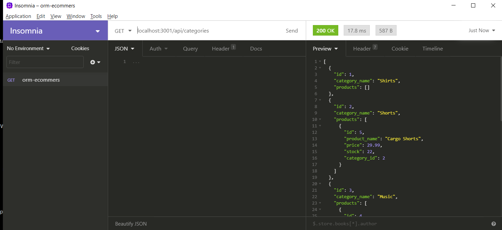
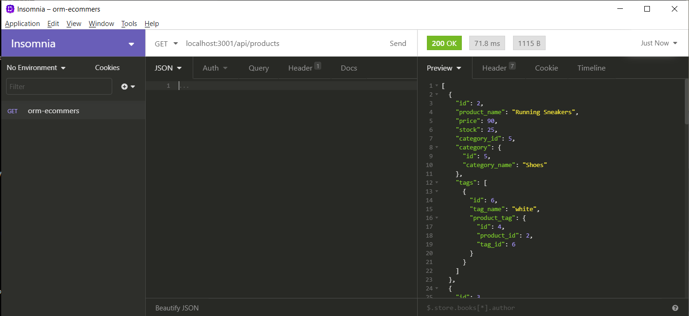

# E-commerce Back End Starter Code

## Purpose

- Build the back end for an e-commerce site
- Take a working Express.js API and configure it to use Sequelize to interact with a MySQL database

[Video Link on Categories/Products endpoints](https://drive.google.com/file/d/1A_7LfO0iIEJHKQCPqChaKgxVryzopHAn/view)
 
[Video Link on Tags endpoints](https://drive.google.com/file/d/1y1cyzQfrQYFLvrRc73O-nygvZNCVVw6A/view)

## User Story

AS A manager at an internet retail company  
I WANT a back end for my e-commerce website that uses the latest technologies  
SO THAT my company can compete with other e-commerce companies  

## Table of Contents
* [Installation](#installation)
* [Usage](#usage)
* [Contributors](#contributors)

## Installation

To use this application, clone this repo `git clone https://github.com/maiyiax/orm-ecommerce.git`. Once this is cloned, navigate to the root directory and install the following modules.
  - `npm install --save mysql2`
  - `npm i sequelize`

You will have to update the mysql username in pw in connection.js in order to run the application. The routes can be tested in your browser via the endpoints or tested through (Insomnia)[https://insomnia.rest/].

## Usage

Using the various endpoints, you can retrieve information about all the categories, products and tags within the database.

 

 
![]{./assets/images/allTags.PNG}

Data can also be retrieved for each by running a search by id. There are also endpoints built to create new categories/products/tags, make updates or make deletions out of the database.

## Contributors

- Starter code provided by UW-Bootcamp
  - [Starter Code](https://github.com/coding-boot-camp/fantastic-umbrella)
